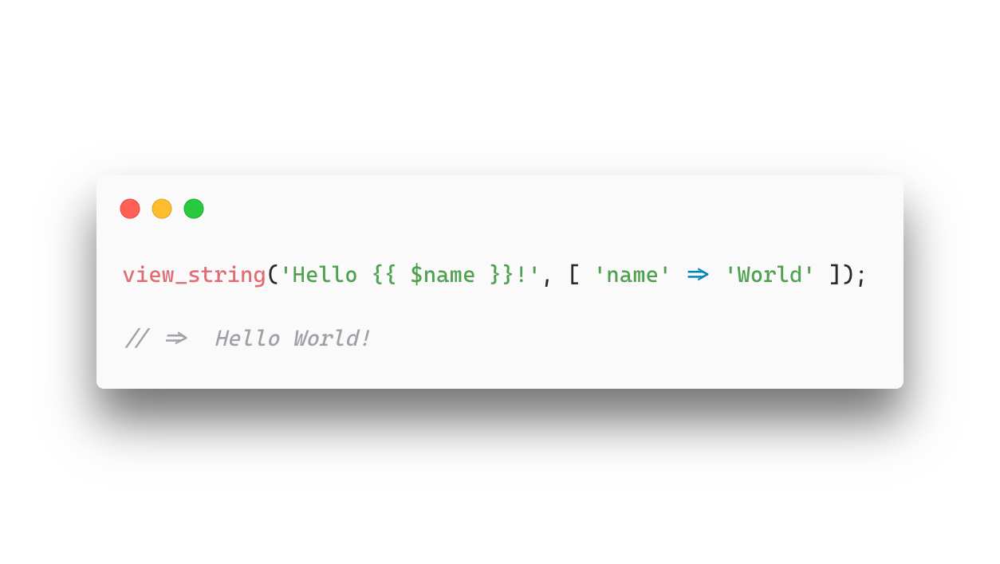

<p align="center"><a href="https://github.com/AdamGaskins/view-string" alt="view-string on Github"></a></p>

<p align="center">The <code>view()</code> helper's little brother; a function to compile blade views from strings.</p>

<p align="center">
    <a href="https://packagist.org/packages/adamgaskins/view-string" alt="Latest Version on Packagist"></a>
    <a href="https://github.com/adamgaskins/view-string/actions?query=workflow%3ATests+branch%3Amaster" alt="GitHub Tests Action Status"></a>
</p>

## Installation

You can install the package via composer:

```bash
composer require adamgaskins/view-string
```

## Usage

This package allows you to compile a blade template dynamically from a string instead of it being hardcoded in the `resources/views` folder of your site. Usually this will look like a trusted user (developer/admin) using an embedded [editor](https://microsoft.github.io/monaco-editor/) to write a blade template which is then saved to the database. You can then easily render the template like so:

```php
$design = Design::find(1);

view_string($design->content, [ 'blogPost' => $post ]);
```

Or if you want to include it in your blade templates, there's a directive for that:

```php
@includeString($design->content [ 'blogPost' => $post ])
```

Use `view_string` where you'd use `view`, and `@includeString` where you'd use `@include`.

## eval
This package uses eval behind the scenes. It is not sandboxed. The goal of this package is to allow developers to write small blade snippets without needing to deploy. I am not responsible for what happens if you let random strangers on the internet run code on your servers.

We use this package at my company to allow us to quickly write tiny snippets of custom elements for our customers, saving us the need to do a full site deploy every time a user requests a change.

## Testing

```bash
composer test
```

## Related
- [`wpb/string-blade-compiler`](https://github.com/TerrePorter/StringBladeCompiler): A great package that I used for years, and inspired this package. A little bit more opinionated though, the fact that it completely replaces `Illuminate\View\View` leads to [issues](https://github.com/TerrePorter/StringBladeCompiler/issues/73) in some random edge cases.

## License

The MIT License (MIT). Please see [License File](LICENSE.md) for more information.
